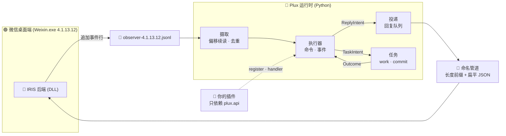

<div align="center">

# 🧩 Plux — 微信机器人 Python 运行时

### 收消息、发消息、存状态，业务只写插件

[](docs/guide/getting-started.md)
[](https://www.python.org/)
[](docs/specs/configuration-spec.md)
[](docs/specs/native-protocol-spec.md)
[](docs/specs/plugin-api-spec.md)

<p align="center">
  <b>架在 IRIS 原生后端之上的服务层</b><br>
  帧编码、能力探测、幂等、有效期、重试与送达证据都由框架处理
</p>

</div>

---

## 🎯 它解决什么问题

不用 Plux 时，回复一条消息意味着自己实现组帧、握手、能力判断、请求去重、有效期与结果分类；用了 Plux，插件只表达意图：

```python
class HelloPlugin(Plugin):
    manifest = PluginManifest("hello")

    def register(self, registry):
        registry.command(CommandSpec("hello", "/hello", self.hello))

    def hello(self, argument, context):
        return respond(context, text="你好")
```

| 你自己写 | Plux 替你写 |
| :--- | :--- |
| 4 字节小端组帧、扁平 JSON 约束、短连接交换 | 命名管道传输与超时取消 |
| `hello` 握手、能力位、会话绑定 | 连接快照与能力门禁 |
| 请求 ID、去重、有效期、重试策略 | 幂等队列与 `unknown` 不重发 |
| 尝试记录、送达证据、崩溃恢复 | 收据、证据投影、启动回收 |

---

## 🌟 它能做什么

- 📥 **消息接收** —— 跟随观察日志按字节偏移续读，事件去重、原始字节留档、内容质量标记；
- 📤 **消息发送** —— 文本、群聊、`@` 提醒、引用回复、图片、语音，带能力探测与结果分类；
- 🗃️ **数据能力** —— SQLite 事务域、带摘要校验的迁移、版本化内容目录、持久状态快照、内容寻址资产；
- ⏰ **后台与定时** —— 可恢复的 `prepare/work/commit/recover` 任务、去重的计划时隙；
- 🧩 **插件化** —— 插件只依赖 `plux.api`，模型不可变、业务拒绝是返回值而不是异常；
- 🪶 **零依赖** —— 只用 Python 标准库，不需要虚拟环境之外的任何东西。

---

## 🗺️ 它怎么工作



**收消息**：后端把每条消息追加成一行 JSON；Plux 顺序读取这个文件，按偏移提交、按事件身份去重，再交给插件。

**发消息**：插件返回 `ReplyIntent`，Plux 在一个事务里落库，然后逐轮把「已提交」的回复通过命名管道交给后端，并把结果与证据写回数据库。

---

## ⚠️ 使用前必读

| 项目 | 要求 |
| :--- | :--- |
| 操作系统 | Windows x64（发送通道使用本地命名管道） |
| Python | **>= 3.11**，且**不依赖任何第三方包** |
| 原生后端 | IRIS，目标版本 **仅 4.1.13.12**（版本不符会被框架主动拒绝） |
| 收发前提 | C++ 后端已构建并注入微信；只用数据与任务能力时不需要 |

> [!WARNING]
> 本仓库的验证停在「离线测试全绿 + 与 C++ 测试宿主联调通过」，**没有**注入真实微信、没有跑通真实收发。Hook 行为、真实送达与媒体格式兼容性都仍未实证。

> [!IMPORTANT]
> `accepted` 只表示原生后端接受了本次提交，**不等于收件人已收到**；`unknown` 表示结果不确定，框架不会自动重发。重复消息的代价被判断为高于漏发。

---

## ⚡ 三步上手

### 第 1 步：安装

```powershell
python -m venv .venv
& '.\.venv\Scripts\Activate.ps1'

python -m pip install -e python
python -m pip install -e python\plugins\examples
```

> 不想安装时，把两个 `src` 目录放进 `PYTHONPATH` 也能工作，见 [构建与开发](docs/development/building.md#2-安装)。

### 第 2 步：检查配置

```powershell
plux --config python\config\platform\plux.example.toml check
```

`check` 只读取配置、加载插件类、校验声明与资源路径，**不会创建数据库、不会连接原生管道**。输出会列出实际加载的插件：

```json
{ "valid": true, "plugins": ["help", "calculator", "counter", "echo",
  "keywords", "poll", "poster", "digest"] }
```

### 第 3 步：空跑一轮

```powershell
plux --config python\config\platform\plux.example.toml run --once
```

```json
{ "ingested": 0, "processed": 0, "task_worked": false, "delivery": "idle" }
```

到这里框架已经在运行了：读日志、跑插件、推进任务队列。示例配置默认 **关闭原生连接与发送**，不会碰微信。

### 第 4 步：接上 IRIS（可选）

```powershell
# 1) 打印框架认为正确的环境变量，交给注入器 / 启动器
plux --config <你的配置> env

# 2) 在 TOML 里填好账号与白名单，并打开开关
#    [policy]   account = "wxid_你的登录账号"
#               allowed_targets = ["好友wxid", "群ID@chatroom"]
#    [observer] enabled = true
#               send_enabled = true
```

命令管道名不需要手填：Plux 从 `command_pipe_ready` 事件自动发现。

> 完整步骤（目录对齐、能力位、连接状态判读）见 [快速上手](docs/guide/getting-started.md#5-接入-iris)。

---

## 🧰 命令行

| 命令 | 作用 |
| :--- | :--- |
| `plux --config <TOML> check` | 校验配置与插件声明，**不产生运行时 IO** |
| `plux --config <TOML> run` | 启动受监督的运行时（`Ctrl+C` 优雅停机） |
| `plux --config <TOML> run --once` | 只跑一轮调度循环 |
| `plux --config <TOML> env` | 打印 IRIS 需要的环境变量 |
| `plux --config <TOML> status` | 读取持久队列 / 处理器 / 任务状态 |
| `plux --config <TOML> maintain [--collect]` | 检查容量，可选回收无引用数据 |
| `plux --config <TOML> backup <目录>` | 一致性备份（数据库 + 资产） |
| `plux --config <TOML> restore <备份> --database <新库> --assets <新资产目录>` | 恢复到不存在的新路径 |

退出码：`0` 正常 · `1` 运行期健康检查失败或停机未完成 · `2` 配置 / 资源 / 数据库错误。

> 各命令的状态语义、备份校验与回收策略见 [运行与运维](docs/guide/operations.md)。

---

## 🧩 示例插件

`python/plugins/examples` 是一组只依赖 `plux.api` 的独立插件，覆盖公共 API 的主要用法：

| 插件 | 演示的能力 |
| :--- | :--- |
| 🆘 `HelpPlugin` / 🧮 `CalculatorPlugin` | 最小命令插件、业务拒绝（`Outcome.rejected` + 回复） |
| 🔢 `CounterPlugin` | 仓储绑定事务、插件迁移、`atomic` 命令、后台任务 |
| 🔁 `EchoPlugin` | 消息事件订阅、`requires_command_policy` 挡掉历史回放 |
| 📖 `KeywordPlugin` | 从 TOML 内容目录加载规则、`resources` 声明 |
| 🗳️ `PollPlugin` | 持久状态快照、`expected_revision` 条件更新 |
| 🖼️ `PosterPlugin` | 图片资产 `stage`/`publish`、媒体回复 |
| 📊 `DigestPlugin` | 定时计划 + 后台任务 + 历史查询 |

> 每个示例的要点与可复制的写法见 [插件开发参考](docs/guide/plugin-development.md)；目录内另有 [示例说明](python/plugins/examples/README.md)。

---

## 🧭 文档导航

### 我是插件开发者

| 文档 | 内容 |
| :--- | :--- |
| 📘 **[插件开发参考](docs/guide/plugin-development.md)** | 插件结构、四种登记、回复约束、事务与后台任务、常见错误 |
| 📗 **[快速上手](docs/guide/getting-started.md)** | 安装、配置、首次运行、接入 IRIS、第一次踩坑 |
| 📐 **[公共 API 规范](docs/specs/plugin-api-spec.md)** | 模型、服务、上下文、错误码的字段级契约 |

### 我是部署 / 运维

| 文档 | 内容 |
| :--- | :--- |
| ⚙️ **[配置规范](docs/specs/configuration-spec.md)** | TOML 全字段、路径推导、环境变量导出 |
| 🛠️ **[运行与运维](docs/guide/operations.md)** | 状态巡检、备份恢复、维护回收、停机语义、锁 |
| 🧯 **[疑难排查](docs/troubleshooting.md)** | 按「现象 → 原因 → 处理」组织 |

### 我要改框架

| 文档 | 内容 |
| :--- | :--- |
| 💡 **[内部实现](docs/architecture-internals.md)** | 事务边界、消费与恢复、调度、资产、迁移、已知取舍 |
| 🔌 **[原生协议规范](docs/specs/native-protocol-spec.md)** | 帧格式、命令字段、事件日志、错误码全表、媒体契约 |
| 🧪 **[构建与开发](docs/development/building.md)** | 安装、测试、跨语言联调、仓库现状与已知缺陷 |

📚 全部文档的入口在 **[文档中心](docs/README.md)**。

---

## 📁 仓库结构

```
README.md                  本文件
docs/                      技术文档：指南 · 规范 · 内部实现 · 排查 · 构建
python/
├── pyproject.toml         分发名 plux-framework
├── src/plux/              框架源码
│   ├── api/               公共模型与服务契约（插件唯一入口）
│   ├── data/              事务域、内容目录、快照、资产、备份
│   ├── messaging/         摄取、查询、回复队列与投递
│   ├── runtime/           装配、执行器、任务、监督、CLI
│   └── adapters/          SQLite · 文件系统 · IRIS 观察者与命名管道
├── config/platform/       运行配置：empty · example · xiuxian
├── plugins/examples/      独立示例插件包（分发名 plux-example-plugins）
└── tests/                 跨模块测试与 C++ 联调宿主
plugins/                   旧 wechat_receiver 版实现，仅作参考，Plux 不加载
```

---

## 🚧 状态与限制

> [!NOTE]
> 0.1 是开发期版本，仍有很多不足。

- **版本锁**：`observer.target_version` 只接受 `4.1.13.12`，其他版本在配置校验阶段就被拒绝。
- **媒体回复有格式契约**：图片必须是 PNG/JPEG，语音必须是 SILK；文件以 `<sha256>.<扩展名>` 落在媒体根目录的直接子级；语音时长由插件负责与后端算出的值
---

## 🔗 相关项目

Plux 依赖 **IRIS 原生后端**（C++，注入微信进程内）提供真正的收信与发信；Plux 只处理协议之外的编排、状态与业务接入。两者之间的边界由 [原生协议规范](docs/specs/native-protocol-spec.md) 固定，C++ 侧的文档在它自己的仓库里。

> [!TIP]
> 只做数据处理与任务调度、不需要收发消息时，可以把 `observer.enabled` 保持为 `false`，整套框架依然可用。

---

## 📜 开源协议

本项目采用 **[GNU General Public License v3.0 (GPL-3.0)](LICENSE)** 开源许可证。

- **自由研习**：允许出于学术研究与技术探讨目的自由查阅、修改与编译本代码；
- **开源传染性**：任何修改、衍生或整合本项目的作品，必须同样以 GPL-3.0 许可证保持完全开源；
- **无担保声明**：代码按「现状」提供，不包含任何明示或暗示的可用性保证（见 GPL-3.0 第 15、16 条）。
