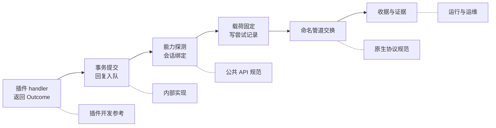

<div align="center">

# 📚 Plux 文档中心

<p align="center">
  先看 <a href="../README.md">README</a> 把运行时跑起来，再按下面的角色选择深入方向。
</p>

</div>

---

## 🧭 按角色导航

### 我是插件开发者

| 文档 | 内容 |
| :--- | :--- |
| 📘 [**插件开发参考**](guide/plugin-development.md) | 插件结构、四种登记、回复约束、事务与后台任务、常见错误对照 |
| 📗 [快速上手](guide/getting-started.md) | 安装、配置、首次运行、接入 IRIS、第一次踩坑 |
| 📐 [公共 API 规范](specs/plugin-api-spec.md) | 模型、服务、上下文、错误的字段级契约 |
| 🧩 [示例插件](../python/plugins/examples/README.md) | 八个可运行的样板，覆盖公共 API 主要用法 |

### 我是部署 / 运维

| 文档 | 内容 |
| :--- | :--- |
| ⚙️ [**配置规范**](specs/configuration-spec.md) | TOML 全字段、路径推导、环境变量导出、常见配置错误 |
| 🛠️ [运行与运维](guide/operations.md) | 状态巡检、备份恢复、维护回收、停机语义、锁 |
| 🧯 [疑难排查](troubleshooting.md) | 按「现象 → 原因 → 处理」组织的速查表 |

### 我要改框架本身

| 文档 | 内容 |
| :--- | :--- |
| 💡 [**内部实现**](architecture-internals.md) | 事务边界、消费与恢复、任务状态机、资产流水线、已知取舍 |
| 🔌 [原生协议规范](specs/native-protocol-spec.md) | 帧格式、命令字段、事件日志、错误码全表、媒体契约 |
| 🧪 [构建与开发](development/building.md) | 安装、测试、跨语言联调、仓库现状与已知缺陷 |
| 🗄️ [历史文档](history/README.md) | 重写前的设计文档，仅作存档 |

---

## 📐 五分钟速览

| 项目 | 值 |
| :--- | :--- |
| 分发名 | `plux-framework`（框架）· `plux-example-plugins`（示例） |
| 公共入口 | `plux.api`，`API_VERSION = "0.1"` |
| Python | `>= 3.11`，无第三方依赖 |
| 原生协议 | `protocol_version = 1`（命名管道，4 字节小端长度前缀 + 扁平 JSON） |
| 事件日志 | `schema_version = 2`（JSONL，按字节偏移续读） |
| 目标后端 | IRIS / 微信 **4.1.13.12** |
| 默认节奏 | `runtime.poll_seconds = 0.2`，一轮最多投递一条回复 |
| 结果语义 | `accepted` = 本地提交成功 · `rejected` = 确定未发送 · `unknown` = 不确定且不重发 |

---

## 🗺️ 一次回复走过哪些文档



---

## 📖 阅读约定

- **必须**、**拒绝**、**不允许**描述的是实现强制的约束；**建议**、**推荐**是实现允许但不强制的选择。
- 代码示例可以直接运行，除非注释里写明需要真实微信。
- 时间一律是带时区的 UTC；字节长度一律指 UTF-8 编码后的长度。
- 文档描述的字段名、错误码、事件名都对照 `python/src/plux` 的实现校对过；`raw_fields` 这类后端保留字段只描述可确认的部分，不猜测语义。
- 文档**不写死任何机器的绝对路径**，统一用 `<仓库根>`、`<runtime_root>`、`<配置>`、`<C++ 仓库>` 这类占位符。

---

## 📂 目录地图

```
docs/
├── README.md                    本文件
├── guide/
│   ├── getting-started.md       安装 → 配置 → 首跑 → 接 IRIS
│   ├── plugin-development.md    插件开发参考
│   └── operations.md            运行、巡检、备份恢复、维护、停机
├── specs/
│   ├── README.md                规范索引与它们之间的边界
│   ├── plugin-api-spec.md       公共 API 契约
│   ├── configuration-spec.md    TOML 配置与目录布局
│   └── native-protocol-spec.md  管道帧、命令、事件、错误码
├── architecture-internals.md    框架内部实现
├── troubleshooting.md           排查手册
├── development/
│   └── building.md              构建、安装、测试
└── history/                     重写前的设计文档（存档，不再维护）
```
