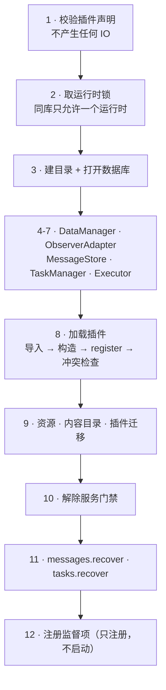
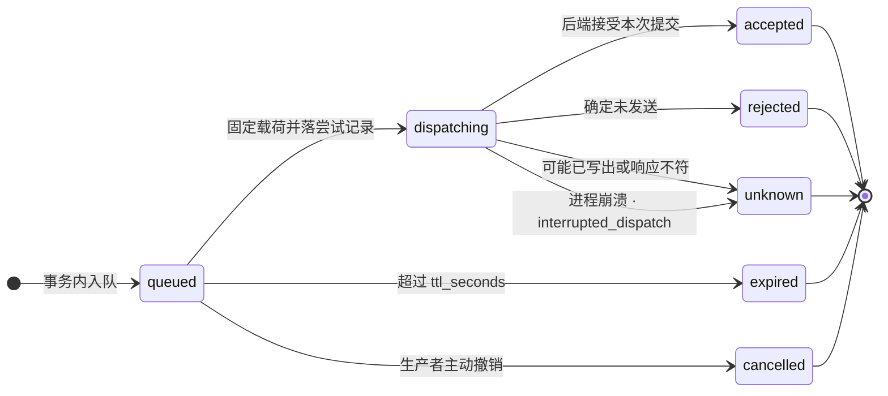
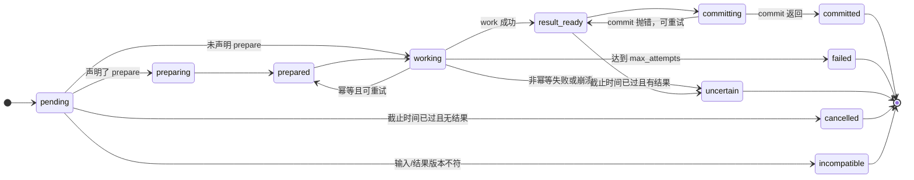

<div align="center">

# 💡 内部实现

[](#)
[](#)

<p align="center">
  面向要改框架的人：解释 <code>python/src/plux</code> 为什么这样组织，以及哪些取舍是有意的。
</p>

</div>

---

## 1. 分层与依赖方向

| 模块 | 职责 | 允许依赖 |
| --- | --- | --- |
| `plux.api` | 公共模型、服务协议、插件入口、错误 | 标准库 |
| `plux.data` | 事务域视图、迁移、内容目录、快照、资产、维护、备份 | `api`、适配器 |
| `plux.messaging` | 摄取、查询、成员、媒体、回复队列与投递 | `api`、`data`、适配器 |
| `plux.runtime` | 装配、注册、执行器、任务、监督、停机、配置、CLI | `api`、数据与消息服务、适配器 |
| `plux.adapters` | SQLite、文件系统、IRIS 观察者与命名管道 | `api` 及外部实现库 |

依赖方向是单向的：`api` 不导入任何实现，运行时按显式入口组合插件；框架不静态导入任何插件模块（`Loader` 用 `importlib` 按配置加载）。

`plux.api.services` 里的 `Protocol` 描述的是**插件看到的形状**，具体实现分布在 `data`/`messaging`/`runtime`/`adapters` 中。协议故意不声明所有实现能力（例如 `TaskServices.cancel` 是实现额外提供的）。

---

## 2. 装配

`Application.prepare()` 的顺序是有意义的：



| 步骤 | 动作 | 失败后果 |
| :--- | :--- | :--- |
| 1 | `validate_plugins(config)`：仅元数据校验，`_UnavailablePort` 挡住一切业务 IO | 无副作用，配置错误不留半个数据库 |
| 2 | 取运行时锁（非阻塞） | 另一个运行时正在使用同一数据库 |
| 3-7 | 建目录、打开数据库、建平台/消息/任务表 | 关库并释放锁 |
| 8 | `Loader.load()`：导入、构造、`register`、冲突检查 | 服务门禁仍在，不会执行业务 |
| 9 | 资源存在性、内容目录加载、插件迁移 | 内容或迁移失败即整体失败 |
| 10 | `loader.activate()`：解除服务门禁 | — |
| 11 | 回收上次崩溃留下的 `dispatching` 与过期租约 | — |
| 12 | `LifecycleSupervisor` 注册资源与工作者 | 只注册，`start()` 才真正启动 |

关键点：

- 第 8 步之前服务被 `_ServiceGate` 包住：业务方法一律抛 `ConfigurationError`，只有 `domain`/`capabilities`/`config`/`repository_factory` 透传。
- 第 12 步只注册不启动；`start()` 时才 `plugin.start()`，然后启动工作线程。

> [!NOTE]
> `start()` 失败会走一次 `supervisor.stop()` 并把应用恢复成未启动状态。

---

## 3. 事务与并发

### 3.1 连接模型

`SqliteDatabase` 为**每个线程**维护一个连接（`check_same_thread=False`，但事务句柄绑定线程）。连接统一 `isolation_level=None`、`foreign_keys=ON`、`busy_timeout=30000`。

`SqliteUnitOfWork`：

- `__enter__` 拒绝嵌套、复用与已关闭数据库，执行 `BEGIN IMMEDIATE`；
- `_check()` 在每次 `execute`/`fetch*` 时校验「仍然活跃 + 同线程 + 数据库未关闭 + 线程本地仍指向自己」；
- `__exit__` 无异常则 commit，commit 失败会先 rollback 再抛出；有异常直接 rollback。

并发模型因此是**单写者**：`BEGIN IMMEDIATE` 立刻取写锁，配合 30 秒 busy timeout，多个线程会串行化而不是得到「database is locked」。查询可以在自己的短事务里并行进行。

### 3.2 SQL 授权器

每个连接都装了 authorizer：`SQLITE_TRANSACTION`、`SQLITE_SAVEPOINT`、`SQLITE_ATTACH`、`SQLITE_DETACH`、`SQLITE_PRAGMA` 以及全部 DDL 动作，在非受控窗口内返回 `SQLITE_DENY`。受控窗口只有两处：执行 `BEGIN IMMEDIATE` 期间、提交/回滚期间。

结果就是插件拿到的 `uow.execute()` 不能改结构、不能附加数据库、不能显式控制事务——DML 与查询是它唯一能做的事。

### 3.3 迁移

`migrate()` 使用独立连接与更严格的授权器，并要求数据库空闲：

- 版本必须从 1 连续；
- 每条迁移的语句列表被 SHA-256 记录在 `plux_migrations`；重复执行时摘要不符直接失败（防止悄悄改历史迁移）；
- 数据库中存在比代码更新的版本时拒绝启动；
- DDL 在迁移专用的受控窗口内执行，不经过插件的 `uow`。

---

## 4. 消费与幂等

三层稳定身份，全部落在数据库里：

| 身份 | 位置 | 作用 |
| --- | --- | --- |
| `event_key = session:seq` | `plux_messages`、`plux_inbox` | 消息与输入的稳定身份 |
| `(plugin_id, handler_id, event_key)` | `plux_handler_runs` | 每个处理器独立的消费标记 |
| `(plugin_id, reply_key)` | `plux_replies` | 回复幂等；`request_id = uuid5(f"plux:{plugin_id}:{reply_key}")` |

执行器在一个事务里完成「查消费标记 → 调 handler → 保存 outcome（业务写入 + 回复 + 任务 + 标记）」。因此崩溃只会导致两种结果：整个事务没发生（下轮重来），或者全部提交（下轮看到标记直接跳过）。

`failed` 是唯一的非终态标记：输入保持 `pending`，每个调度周期都会被重试并累加 `attempts`。这给了「临时故障自愈」的能力，代价是确定性故障会形成重试循环。

回复的 `request_id` 由 `reply_key` 派生而不是随机生成，所以「同一个业务回复意图」在崩溃重放后仍然指向同一条记录，不会产生两条队列项。

---

## 5. 消息摄取

`MessageStore.poll_log()` 在一个事务里完成「读字节 → 解析 → 落原始记录 → 生成消息 → 入队 → 推进偏移」。要点：

- 偏移与消息、原始字节、issue 同事务提交，所以不会出现「消息进了但偏移没动」的重复摄取；
- 文件被截断或替换时 `generation + 1`、`offset = 0`、`session` 清空，重新读一遍，靠 `event_key` 去重；
- 单行上限 2 MiB，超长行截断记录并跳过剩余部分，保证下一次读取从行边界开始；
- **首次轮询把当时文件的全部内容视为 backlog**：`_poll_backlog_end` 记录当次文件大小，早于它的行 `ingestion_status = "backlog"`。这是命令门禁的基础，也是「启动前写好的日志不会被回答」的原因。

原始记录（`plux_raw_events`）保留字节级别的证据，`record_json` 保留规范化 JSON；引用回复需要的原生消息 ID 与时间戳就是从 `raw_fields` 里取的。

---

## 6. 交付

`dispatch_once()` 是唯一写管道的路径，全程持有 `SenderLock`（进程内互斥 + 跨进程文件锁）：

```
_recover_locked()  回收 dispatching 与「已排队但有尝试记录」的请求 → unknown
标记过期            status='queued' AND expires_at<=now → expired
挑选候选            ORDER BY created_at, request_id（单个 request_id 时只处理它）
probe()             hello_media → hello 退级
逐条尝试            账号/会话/目标/能力校验 → 生成并固定原生载荷 → dispatching → exchange → 结果
```

设计取舍：

- **一轮只发一条。** 突发流量按轮次排空；`poll_seconds` 决定上限。
- **一次投递一次探测。** 每次投递前重新握手，拿到的会话与能力是最新的；代价是两倍连接往返。
- **载荷在创建尝试前固定。** `native_json` + `native_fingerprint` 一经写入不再改变，重放必须通过身份与指纹校验，防止「同一条逻辑回复被换成另一份内容」。
- **不确定就不重发。** 传输错误只有在确定没写出（`may_have_written=False`）时才是 `rejected`，否则 `unknown`。这是「宁可漏发也不重发」的取向，因为重复消息的代价高于漏发。
- **能力是投递时判定的。** 插件入队一个媒体回复而当时没有媒体能力，请求会留在 `queued` 等能力恢复，而不是被拒绝。

回复请求的状态机：



> [!NOTE]
> `_prepared_payload()` 里「已经有 `native_json`」的分支在当前流程中不会出现（写 `native_json` 与把状态改成 `dispatching` 在同一个事务里，而候选只取 `queued`），它是为将来的重放路径预留的一致性校验。

---

## 7. 任务调度

`TaskManager.tick()` 每个周期做两件事：推进计划时隙，然后认领**最多一个**任务。

计划：时隙号是 `时间戳 // interval_seconds`，`plux_schedule_slots` 记录每个计划的最后时隙。`coalesce` 只取当前时隙，`catch_up` 逐槽生成但单次上限 100，`skip` 直接把 last_slot 推到当前。首次运行没有记录时，当前时隙视为到期——所以计划任务在启动后立刻跑一次。

认领：`_claim` 用一条 `UPDATE ... WHERE status=?` 配合租约令牌实现「单所有者」。租约到期后由 `recover()` 处理：

| 崩溃时状态 | 有结果 | `recover` 回调 | `idempotent` | 恢复为 |
| --- | --- | --- | --- | --- |
| `preparing` | — | — | — | `pending`（重做 prepare） |
| `working` | 有 | — | — | `result_ready`（跳过 work，直接 commit） |
| `working` | 无 | 有 | — | `verifying`（事务外核验） |
| `working` | 无 | 无 | 是 | `prepared`（允许重跑 work） |
| `working` | 无 | 无 | 否 | `uncertain`（不自动重放） |
| 任意 | — | — | 且已请求取消 | `cancelled`（work 前）/ `uncertain`（work 后） |

`work` 在事务外执行；结果序列化后写入 `result`，再由 `commit` 在新事务里落库。`commit` 的 `Outcome.status` 不被解释——任务是否收尾只看 `commit` 是否正常返回，副作用是它的 `replies`/`tasks`。



---

## 8. 数据层

### 8.1 内容目录

`CatalogStore.load()`：读来源（包内 `Mapping` 或 JSON/TOML 文件）→ 与 `override` 深合并 → `validator` 校验 → `_freeze` 成只读结构 → 规范化 JSON 求 SHA-256 → 与已存版本比对（不同则 `ConflictError`）→ 写入 `plux_catalogs` 并更新 `plux_catalog_latest`。

`get()` 先查内存缓存，再查数据库，读回时重新冻结。内容因此是「启动时定型、运行期只读」的。

`validate_reference()` 用于快照与任务：引用一个版本时，如果该版本下有多个名字，必须带上 `name` 才能唯一确定。

### 8.2 快照

`SnapshotStore.put()` 强制 `structure_version >= 1` 与 `durability == "persistent"`，用「带上期望修订号的 UPDATE + rowcount 检查」实现乐观并发；`expected_revision=None` 表示仅创建。资产引用按差集 retain/release。

### 8.3 资产

```
stage:   写 <staging_root>/<uuid> (xb) → 边写边算 SHA-256 → fsync → 落 plux_staging
publish: 查 staging → 目标 <asset_root>/<id[:2]>/<id>（确定性）
         → 校验并 os.replace → 再校验 → 一个事务里插 plux_assets + 回填 published_asset_id
resolve: 校验 owner/尺寸/摘要后才返回路径
```

几个有意的设计：

- `stage`/`publish` 都要求**不在写事务中**：IO 与数据库提交分离，长文件操作不占写锁。
- publish 的目标路径是确定性的，所以「文件已就位但数据库提交前中断」可以安全重试。
- 内容校验贯穿始终：摘要不符的文件永远不会被交给原生后端。
- 没有按摘要查找/去重的接口，重复 `stage` 会产生新资产。

### 8.4 维护与备份

`collect()` 在 `_maintenance_lock`（与 publish/backup 共用）下先删元数据、提交，再删文件。这是有意的顺序：反过来的话，提交失败会留下「有引用但文件已删」的不可恢复状态；而删文件失败只留下垃圾，下次再删。

`backup()` 用 SQLite 在线备份 API 生成 `data.sqlite3`，然后校验 `integrity_check`、外键、内容目录摘要、资产与暂存的路径/摘要/尺寸，再逐文件复制并复算哈希，最后写 `manifest.json` 并原子改名。整个过程在临时目录里进行，失败即整体丢弃。

`restore_backup()` 要求目标路径不存在，先全部复制到 `*.restore-tmp` 并校验，再整体改名；数据库与资产不一致时不会留下半个恢复结果。

---

## 9. 生命周期与停机

`LifecycleSupervisor` 管理四类条目：

| 类别 | 例子 |
| --- | --- |
| 工作者线程 | `runtime` 调度循环 |
| 生产者 | 需要先停输入的生产者 |
| 排空器 | 需要「停止 + 等待真正结束」的队列 |
| 资源 | 运行时锁、数据库 |

停机顺序：置停止标志 → 生产者 stop → join 工作者 → 逆序 `plugin.stop()` → 排空 → 逆序关资源。

规则：

- 有工作者没停下来时，**不**停插件、**不**关资源；报告里直接列出是谁还在跑。
- 关闭失败也算活动项，避免在依赖仍被使用时释放它们。
- 资源按注册的逆序关闭：先数据库，再运行时锁。
- 只有 `stopped and resources_closed` 才把应用置回未启动状态。

`application.stop()` 是幂等的：未 prepared 时直接返回，已启动时会给出报告。

---

## 10. 已知取舍与限制

| 事实 | 原因 / 影响 |
| --- | --- |
| 一轮只投递一条回复 | 简化并发模型；吞吐由 `poll_seconds` 决定 |
| 每次投递前重新握手 | 会话与能力必须最新；代价是每个回复两个连接往返 |
| 文本上限硬编码 16384 | 与后端当前限制一致；hello 返回的 `max_text_bytes` 只做校验不做决策 |
| hello 响应字段全等校验 | 后端新增能力字段会立即失败，避免「静默降级」 |
| 媒体导出副本不受引用表管理 | 数量以不同内容为上限；需要时可单独加清理策略 |
| 事件处理器会收到自己发出的消息 | 由插件判断 `direction`，或用 `requires_command_policy` |
| handler 异常导致无限重试 | 换取故障自愈；插件应把环境性失败表达为 `Outcome.rejected` |
| `commit` 的 `Outcome.status` 不被解释 | 只取它的 `replies`/`tasks` 副作用 |
| 首次轮询的内容都是 backlog | 防止重启后重答历史 |
| 每轮最多记录 32 条（后端） | 后端不产生 `dropped` 事件时，框架侧无法感知丢件 |
| 没有资产去重/查询接口 | 每次 `stage` 产生新资产 |
| 引用可行性在提交时才校验 | 插件无法预先判断，校验失败会回滚整个处理 |
| 插件无沙箱 | 进程内可信代码，不承诺恶意插件或死循环隔离 |
| 只支持 SQLite 单一事务域 | 跨库、跨资源没有统一原子性，用任务与补偿表达 |
