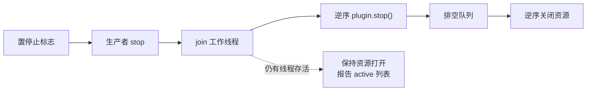

<div align="center">

# 🛠️ 运行与运维

[](#)
[](#4-锁)

<p align="center">
  单进程、单运行时锁、以 SQLite 为唯一权威状态。理解这篇就能安全地重启、备份和恢复它。
</p>

</div>

---

## 1. 运行模型

`Application.start(background=True)` 会启动一个名为 `runtime` 的守护线程，循环执行 `step()`；`--once` 则只跑一次：

```python
def step(self):
    ingested = self.messages.poll_log(...)       # 读观察日志并按偏移落库
    processed = self.executor.drain(...)         # 调度命令与事件
    self.tasks.recover()                         # 回收过期租约
    worked = self.tasks.tick()                   # 推进一个任务或计划时隙
    receipt = self.messages.dispatch_once()      # 投递一条回复（仅当启用发送）
    return {"ingested":..., "processed":..., "task_worked":..., "delivery":...}
```

一轮最多投递**一条**回复，而且投递前会做一次能力探测。突发流量下队列是按 `created_at` 顺序逐轮排空的，`runtime.poll_seconds` 直接决定排空速度。

单轮内的顺序也是有意的：先摄取，再跑插件，最后才推进任务和投递。因此同一轮里产生的回复不会在同一轮发出去。

---

## 2. 状态巡检

```powershell
plux --config <配置> status
```

```json
{
  "initialized": true,
  "database": "...\\platform.sqlite3",
  "states": {
    "plux_inbox": { "complete": 128 },
    "plux_handler_runs": { "success": 121, "noop": 6, "failed": 1 },
    "plux_tasks": { "committed": 4 },
    "plux_replies": { "accepted": 30, "rejected": 2 }
  }
}
```

`status` 只读数据库，不取运行时锁，可以随时执行。

### 2.1 回复状态

| 状态 | 含义 | 会不会再尝试 |
| --- | --- | --- |
| `queued` | 已入队，等待投递 | 会 |
| `dispatching` | 正在投递（进程崩溃会留下这个状态） | 启动时被回收 |
| `accepted` | 原生后端接受本次提交。**不等于收件人已收到** | 不会 |
| `rejected` | 明确未发送（能力缺失、参数被拒、目标不允许等） | 不会 |
| `unknown` | 结果不确定。框架**不**自动重发 | 不会 |
| `expired` | 超过 `ttl_seconds` 仍未投递 | 不会 |
| `cancelled` | 生产者主动撤销（`messages.cancel`） | 不会 |

启动时会做两件回收：把残留的 `dispatching` 记为 `unknown` / `interrupted_dispatch`；把「已排队但已有尝试记录」的请求记为 `unknown` / `attempt_already_exists`。两种情况都涉及「可能已经写出去了」，所以宁可不确定也不重发。

`messages.receipt(request_id)` 返回请求状态、每次尝试与关联的发送证据（后端会上报 `native_send_request` / `native_send_result` 事件）。

### 2.2 处理器与输入

- `plux_inbox`：待处理输入。`pending` 会一直被重试，`complete` 表示已确认消费。
- `plux_handler_runs`：`(plugin_id, handler_id, event_key)` 维度的消费标记。`success` / `rejected` / `noop` 是终态；`failed` 会重试并累加 `attempts`。
- 一条消息只有在所有命中的处理器都成功收尾后才离开待处理队列。**持续 `failed` 的处理器 = 每个周期都在重试。**

### 2.3 任务

`plux_tasks` 的状态解释见 [插件开发参考 §7](plugin-development.md#7-后台任务)。运维上关注两类：长期停留的 `uncertain`（需要业务侧核验）和 `failed`（已达到尝试上限）。

---

## 3. 停机

`Ctrl+C` 或 `application.stop(timeout)` 触发合作式停机。顺序固定：

```
置停止标志 → 生产者的 stop → 等工作线程结束 → 逆序 stop 插件
          → 排空 → 逆序关闭资源
```



关键语义：

- **超时不会假装已经结束。** 只要还有活动项，`StopReport.stopped` 就是 `False`，`active` 列出具体是谁。
- **资源只在没有活动项时才关闭。** 有线程没停下来，数据库和运行时锁都会保持打开，`resources_closed` 为 `False`。
- `application.stop()` 只有在 `stopped and resources_closed` 时才把应用置回未启动状态；否则返回报告，进程仍然持有资源。
- 注册的资源按逆序关闭：先关数据库，再释放运行时锁。
- Python 停止**不代表**原生动作停止。

CLI 的退出码会体现这些：停机未完成返回 `1`。

---

## 4. 锁

| 锁 | 文件 | 作用 |
| --- | --- | --- |
| 运行时锁 | `<database>.runtime.lock` | 非阻塞互斥：同一数据库只允许一个运行时。第二个 `Application.prepare()` 直接抛 `ConfigurationError` |
| 发送锁 | `<database>.sender.lock` | 投递与恢复串行化；`backup` / `maintain` 也要先取运行时锁 |

锁文件会留在磁盘上，这是正常的；它表示的是「曾经用过」，不是「正在运行」。

---

## 5. 备份与恢复

备份是一致性快照 + 可验证清单，不会覆盖任何已有路径。

```powershell
plux --config <配置> backup D:\backup\2026-10-08
```

产物：

```
D:\backup\2026-10-08\
├── data.sqlite3       用 SQLite 在线备份 API 生成
├── assets\            所有被引用的已发布资产（按记录路径）
├── staging\           所有未发布的暂存项
└── manifest.json      数据库摘要 + 每个资产的 path/sha256/size
```

备份过程：取临时目录 → 在线备份数据库 → 校验 `integrity_check`、外键、内容目录摘要、资产元数据 → 逐文件复制并复算 SHA-256 → 写清单 → 原子改名为目标目录。任何一步失败都会删除临时目录并放弃，**不会**留下半个备份。

恢复目标必须是**不存在**的路径：

```powershell
plux --config <配置> restore D:\backup\2026-10-08 `
    --database D:\restore\platform.sqlite3 `
    --assets   D:\restore\outbound `
    --staging  D:\restore\staging
```

恢复会先校验清单与每个文件的摘要，再写入 `*.restore-tmp`，最后整体改名。数据库、资产、暂存三个目标必须互不相同。

备份与恢复都要求运行时已停止（它们会取运行时锁）。

---

## 6. 维护与容量

```powershell
plux --config <配置> maintain
plux --config <配置> maintain --collect --limit 100 --older-than-hours 24
```

不带 `--collect` 时只报告：

```json
{ "assets": 12, "asset_bytes": 348192, "staged": 2, "staged_bytes": 2048,
  "references": 14, "snapshots": 3 }
```

`--collect` 回收「早于阈值且**没有任何引用**」的暂存项与已发布资产：

- **先提交元数据删除，再删文件。** 反过来会在提交失败时留下「有引用但文件没了」的坏状态。
- 删除失败的文件不会回滚元数据，会计入 `files_pending_removal`，下一次回收继续尝试。
- 被未发送回复、快照或任务引用的资产不会被删。
- 回收范围可以按插件命名空间限定（`platform` 命名空间表示全部）。

> [!IMPORTANT]
> 媒体发送会在媒体根目录下额外生成 `<sha256>.<扩展名>` 的原生副本。这些副本不在引用表里，所以回收不会删除它们；它们的数量以「曾经发送过的不同内容」为上限。

---

## 7. 日志

CLI 会把根日志级别设为 `INFO`。常用 logger 名：

| 名称 | 内容 |
| --- | --- |
| `plux.check` | `check` 子命令的插件校验 |
| `plux.plugin.<plugin_id>` | 插件通过 `services.logger` 写的日志 |
| 根 logger | 运行时启停、连接状态、异常 |

框架不会把数据库细节或原生错误码直接写进用户可见的回复；错误码保留在收据与日志里。

---

## 8. 例行检查清单

| 频率 | 检查 |
| --- | --- |
| 每次启动后 | `run --once` 的输出是否合理；没有 `another Plux runtime owns` |
| 每天 | `plux status` 里有没有攒着不动的 `queued` / `failed` / `uncertain` |
| 出现异常后 | 观察日志里的 `command_pipe_error` / `observer_disabled` / `native_sender_disabled` / `dropped` 记录 |
| 变更插件后 | `plux check`；数据库迁移版本是否连续 |
| 定期 | 备份并演练一次恢复；`maintain` 看容量增长 |

异常现象对照见 [疑难排查](../troubleshooting.md)。
