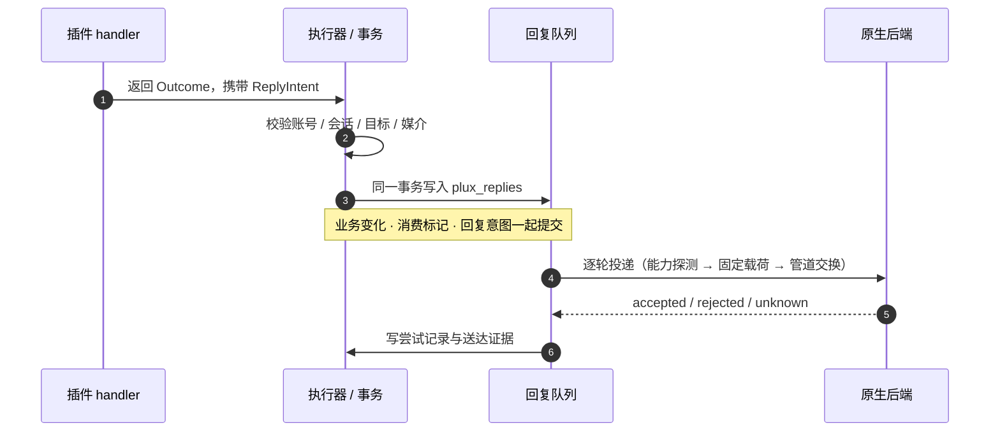

<div align="center">

# 📘 插件开发参考

[](../specs/plugin-api-spec.md)
[](../../python/plugins/examples/README.md)

<p align="center">
  写一个 Plux 插件需要知道的全部契约。可运行的样例在 <code>python/plugins/examples</code>。
</p>

</div>

---

## 1. 最小插件

```python
# mybot/greeting.py
from plux.api import CommandSpec, Outcome, Plugin, PluginContext, PluginManifest

class GreetingPlugin(Plugin):
    manifest = PluginManifest("greeting")

    def register(self, registry) -> None:
        registry.command(CommandSpec("hello", "/hello", self.hello))

    def hello(self, argument: str, context: PluginContext) -> Outcome:
        return Outcome.success(replies=(ReplyIntent(
            f"{context.event_key}:hello", context.account, context.conversation,
            context.native_session, text="你好"),))
```

在配置里显式列出入口：

```toml
[[plugins]]
entrypoint = "mybot.greeting:GreetingPlugin"
```

四件事必须有：类级 `manifest`、继承 `Plugin`、`register()`、配置里的 `module:Class` 入口。框架不扫描目录，也没有导入副作用注册和热重载。

`manifest` 的字段：

| 字段 | 默认 | 说明 |
| --- | --- | --- |
| `plugin_id` | — | 唯一身份，字母数字加 `_`/`-`；同时是默认的数据归属 |
| `version` | `"0.1.0"` | 插件自身版本 |
| `api` | `"0.1"` | 要求的公共 API 版本，不匹配拒绝加载 |
| `dependencies` | `()` | 依赖的其他 `plugin_id`，按拓扑顺序加载 |
| `capabilities` | `frozenset()` | 需要的平台能力，缺失则拒绝加载 |
| `namespace` | `None` | 数据归属；默认等于 `plugin_id`，`platform` 为保留字 |
| `database_domain` | `"main"` | 目前只支持 `"main"` |
| `migrations` | `()` | 有序迁移集，版本必须从 1 连续 |
| `config_validator` | `None` | 校验并规范化 `[[plugins]].config` |
| `catalogs` | `()` | 启动时加载的内容目录 |
| `resources` | `()` | 需要存在的资源路径，缺失时启动失败 |

平台能力全集（`capabilities` 只能取这里的值）：

```
transactions conditional_updates json migrations catalogs assets snapshots
tasks schedules messages history directory media delivery observer_v1
```

---

## 2. 生命周期

```
读取配置 → 校验 manifest 与 config → 轻量构造 → register()
        → 加载内容目录 → 执行插件迁移 → 激活服务门禁
        → start() → （运行期）→ stop()
```

两条硬性规则：

1. **构造与 `register()` 阶段不能做业务 IO。** 这段时间服务被门禁包住，任何业务方法调用抛 `ConfigurationError`；只有 `domain`、`capabilities`、`config` 和 `repository_factory` 可用。把读文件、查数据库、发消息放到 `start()` 或 handler 里。
2. **`start()` 失败则整个启动失败。** 适合做：读取并在内存里冻结内容、发布长期复用的资产、打开需要长期持有的资源。

`stop()` 用于停止业务生产和释放资源。运行时的线程排空、超时与连接关闭由框架协调，插件不需要自己启常驻线程（也不允许）。

---

## 3. 四种登记

`register(registry)` 里只能声明，不能执行。四种登记的语义差别很大：

| 登记 | 触发 | 执行模式 | 冲突行为 |
| --- | --- | --- | --- |
| `command` | 文本精确等于 `trigger` 或以其加空格开头 | `stateless` / `atomic` | 同 trigger 且同 priority 直接拒绝启动 |
| `event` | 消息类型匹配且可选 `predicate` 通过 | `stateless` / `atomic` | 允许有意多订阅，每个处理器独立消费标记 |
| `schedule` | 固定间隔的时隙 | 生成后台任务 | 同一 `schedule_id` 唯一 |
| `task` | 由 `TaskIntent` 或计划创建 | `prepare`/`work`/`commit`/`recover` | 同 `task_type` 唯一 |

### 命令

```python
registry.command(CommandSpec("calc", "/calc", self.calculate, mode="stateless", priority=0))
```

- 匹配规则：`文本 == trigger` 或 `文本.startswith(trigger + " ")`。**不会**匹配 `/calculator`。
- 一条消息最多命中一个命令：先按 `priority` 再按 trigger 长度取最大的那个。
- handler 收到 `(argument, context)`，`argument` 是去掉 trigger 并 strip 后的剩余文本。
- 默认 `mode="stateless"`。

### 事件

```python
registry.event(EventSpec("echo", self.echo, message_type=TextMessage, mode="atomic",
                         requires_command_policy=True))
```

- 所有类型匹配的事件都会收到消息，包括 `direction` 为 `self_sync` / `outbound_request` 的消息。**事件处理器必须自己判断方向**，或使用 `requires_command_policy=True`（见下）。
- `predicate` 在 handler 之前执行，返回假则记 `noop`。
- `serial_key` 目前不支持，声明它会直接抛 `ConfigurationError`。

### 计划

```python
registry.schedule(ScheduleSpec("hourly", "digest", 3600, payload=None, missed_policy="skip"))
```

- `timezone` 只接受 `"UTC"`；`interval_seconds` 必须是正整数。
- 时隙号是 `int(时间戳) // interval_seconds`，每个时隙最多生成一个 `task_key = f"schedule:{schedule_id}:{slot}"` 的任务。
- `missed_policy`：`skip` 跳过停机期间的空档；`coalesce` 只补最近一个；`catch_up` 逐槽补跑，单次最多 100 个。
- **首次启动会立即执行当前时隙**（没有历史记录时视当前时隙为到期），如果需要「等一个完整周期」，在 `work` 里按业务时间自行判断。
- `payload` 是静态的，写在 manifest 里；动态目标要从 `config` 或状态里取。

### 任务类型

```python
registry.task(TaskSpec("increment", self.work, self.commit,
                       prepare=None, recover=None, idempotent=True,
                       max_attempts=3, timeout_seconds=60.0))
```

见 [第 7 节](#7-后台任务)。

---

## 4. 回复



### 4.1 用 `Outcome` 表达意图

handler 返回 `Outcome`，框架在同一个事务域里提交业务变化、消费标记与回复意图：

```python
Outcome.success(result=None, replies=(...), tasks=(...))   # 正常完成
Outcome.rejected("error_code", replies=(...))              # 业务拒绝，是正常结果
Outcome.noop()                                             # 什么也不做
```

返回非 `Outcome` 或非法 `status` 会抛 `ConfigurationError`；在 `atomic` 模式下，整个事务（包括业务写入）一起回滚。

### 4.2 `ReplyIntent` 的硬约束

`ReplyIntent(reply_key, account, conversation, native_session, text=None, asset=None, mentions=(), quote=None, ttl_seconds=300, source_event_key=None, duration_ms=0)`

| 字段 | 约束 |
| --- | --- |
| `reply_key` | 必填。与 `plugin_id` 组成幂等键 |
| `account` | 必须精确等于 `policy.account` |
| `conversation` | 必须在 `policy.allowed_targets` 里；只能形如 `[A-Za-z0-9_-]{1,128}` 或该形式加 `@chatroom` |
| `native_session` | 必填。必须是当前观察会话 |
| `text` / `asset` | **恰好一个**。`text` 非空且 ≤ 16384 UTF-8 字节 |
| `mentions` | ≤ 16 个且 `member_id` 不重复；只能在群聊里用；成员身份必须与本会话一致 |
| `quote` | 只能引用同一会话里已捕获的入站纯文本消息 |
| `ttl_seconds` | 1..600，默认 300 |
| `duration_ms` | 仅语音可用：0 < 值 ≤ 60000 且是 20 的整数倍；其他类型必须为 0 |
| `asset` + `mentions`/`quote` | 媒体回复不能同时带提醒或引用 |

同一个 `(plugin_id, reply_key)` 重复提交：内容指纹相同则复用原请求（幂等），不同则报错。

### 4.3 从哪里拿会话身份

`PluginContext` 已经把回复需要的一切准备好了：

```python
context.account           # 本次调用的账号
context.conversation      # 本次调用的会话
context.native_session    # 本次调用的原生会话
context.event_key         # 稳定输入身份，适合做 reply_key 前缀
context.actor             # 发送者；后台任务调用为 None
context.uow               # 有效事务作用域，可能为 None
context.cancellation      # 合作式取消信号
```

因此推荐的写法是三个助手（`plux_plugins.examples.support` 里有一份可直接抄的）：

```python
def respond(context, *, text=None, asset=None, mentions=(), quote=None, result=None, suffix="reply"):
    intent = reply(context, text=text, asset=asset, mentions=mentions, quote=quote, suffix=suffix)
    if intent is None:                      # 没有可回复的会话
        return Outcome.rejected("native_session_unavailable")
    return Outcome.success(result, replies=(intent,))
```

> [!WARNING]
> **不要**让 `reply()` 在缺会话时抛异常。handler 抛异常会让输入一直留在待处理队列里每个周期重试（见 [第 6 节](#6-事务与执行模式)）。

### 4.4 后台任务里的回复

任务调用的 `context.account` / `conversation` / `native_session` 都是 `None`。两种做法：

- **读取当前会话**（推荐用于「发给某会话」的定时消息）：`services.messages.connection()` 拿 `account` 与 `native_session`，目标会话从配置或状态里取。
- **沿用消息上下文**（推荐用于「处理这条消息后回复」）：在受理任务时把 `account`/`conversation`/`native_session` 写进 `TaskIntent.payload`，`commit` 时读出来。注意会话一旦更替，这条回复会因会话不匹配被跳过，直到有效期结束。

---

## 5. 可用的服务

```python
self.services.messages    # 查询、历史、成员、连接、回执、手工入队、取消
self.services.data        # database / catalogs / assets / snapshots / maintenance
self.services.tasks       # 后台任务入队、查询、取消
self.services.clock       # 带时区的当前时间
self.services.logger      # 插件作用域的标准 logging
self.services.config      # 已通过 config_validator 的配置
```

要点：

- `messages.get(event_key, uow)` / `history(query, uow)` / `member(ref, uow)` / `media(key, uow)` / `receipt(request_id, uow)` 在不传 `uow` 时会自己开一个短事务；传了就参与当前事务。
- `messages.enqueue(intent, uow)` 用于「需要在提交前确认入队结果」的场景（例如引用失败时降级为普通文本）；普通场景请返回 `Outcome.replies`。
- `messages.connection()` 是内存快照，不产生 IO，可以在任何阶段调用。
- `data.repository_factory(Repo)` 在装配时绑定，`bind(uow)` 时才要求有效事务；跨事务或拿别人的 `uow` 绑定会抛 `InvalidScope`。
- `services` 引用可以长期保存，**`uow` 不能**：离开当前处理作用域即失效。

---

## 6. 事务与执行模式

| 模式 | handler 看到的事务 | 适用 |
| --- | --- | --- |
| `stateless` | `context.uow` 为 `None`；handler 在事务外执行，之后框架再开事务保存 `Outcome` 与消费标记 | 纯计算、只读查询 |
| `atomic` | handler 与业务写入、消费标记、回复意图在同一个事务里 | 需要「业务变化与回复要么都成、要么都不成」 |

**失败语义很重要**：handler 抛异常时，框架记一条 `failed` 处理记录并**不**确认消费，输入保持待处理，于是下一个周期会重试。这意味着：

- 环境性失败（没有会话、后端不可用）应当表达成 `Outcome.rejected(...)`，而不是异常；
- 确定性失败（必然抛异常的输入）会变成每个周期都在重试的循环；
- 需要重试的异常应保留可恢复的中间状态，而不是把副作用做一半。

`atomic` 模式下，回复校验失败（例如引用了不可引用的消息）会让事务整体回滚，业务写入也一并撤销。这是特性：不会留下「业务做了但回复没发出」的中间态。

---

## 7. 后台任务

任务把「长活」拆成可恢复的阶段：

```python
TaskSpec("digest", work=self.work, commit=self.commit, prepare=None, recover=None,
         idempotent=True, max_attempts=2, timeout_seconds=60.0)
```

| 阶段 | 事务 | 用途 |
| --- | --- | --- |
| `prepare` | 有 | 可选的预处理，结果持久化 |
| `work` | 无 | 渲染、文件处理、受限外部 IO；**不要在这里写数据库** |
| `commit` | 有 | 把 `work` 的结果落库、入队回复与新任务 |
| `recover` | 无 | 崩溃后核验外部动作是否真的发生过；返回结果表示已确认，返回 `None` 表示无法确认 |

状态流转：

```
pending → (preparing → prepared) → working → result_ready → committing → committed
                                              ↘ failed / uncertain / cancelled / incompatible
```

- `idempotent=True` 表示 `work` 可以安全重放；崩溃恢复时非幂等任务会进入 `uncertain` 而不是直接重跑。
- `attempts` 达到 `max_attempts` 记 `failed`；`commit` 阶段单独计数，上限是 `max(3, max_attempts)`。
- `deadline` 过期时：已有结果 → `uncertain`，否则 → `cancelled`。
- 取消是合作式的：`tasks.cancel(task_key)` 置位，任务在下一个检查点结束。
- 声明了 `assets` 的任务会在受理时 retain、终态时 release。

> [!NOTE]
> `commit` 返回的 `Outcome.status` **不会被解释**。任务是否 `committed` 只取决于 `commit` 是否正常返回；它的 `replies` / `tasks` 才是副作用。因此用 `Outcome.rejected(...)`（不带回复）表达「本轮无法投递」是有效的：任务正常收尾，不产生回复。

---

## 8. 数据

### 8.1 迁移

```python
manifest = PluginManifest("counter", migrations=(Migration(1, (
    "CREATE TABLE example_counter(account TEXT, conversation TEXT, actor TEXT, "
    "value INTEGER NOT NULL, PRIMARY KEY(account,conversation,actor))",)),))
```

- 版本必须从 1 开始且连续；已应用迁移的内容摘要被记录，改动已应用的迁移会启动失败。
- 数据库里的版本比代码新时拒绝启动（避免旧代码操作新结构）。
- 迁移只在启动时执行，且在插件 handler 之外。
- 停用或卸载插件**不会**删除它的表。

### 8.2 仓储

```python
def __init__(self, services):
    super().__init__(services)
    self.repositories = services.data.repository_factory(CounterRepository)

def count(self, argument, context):
    repo = self.repositories.bind(context.uow)      # 必须是当前事务
```

仓储只是「当前事务的一张视图」，`bind` 校验数据库身份、事务活跃与线程归属。仓储不自己连接、不自己提交。

### 8.3 内容目录

```python
_CONTENT = Path(__file__).resolve().parent / "content" / "keywords.toml"

manifest = PluginManifest(
    "keywords",
    catalogs=(CatalogSpec("keywords", "1", _CONTENT, validator=_rules),),
    resources=(_CONTENT,))
```

- `default` 可以是包内 `Mapping`，也可以是 **JSON/TOML 文件路径**。相对路径会按进程工作目录解析，所以务必用 `Path(__file__)` 算出绝对路径。
- 加载流程：读文件 → 与 `override` 深合并 → `validator` 校验 → 冻结 → 计算摘要 → 落库 → 更新 latest 指针。同一 `(namespace, name, version)` 内容变了会报冲突，发布新版本请改 `version`。
- `version=None` 取 latest；启动时 `load` 会把 latest 指向本次声明的版本。
- 覆盖通过 manifest 里的 `CatalogSpec.override` 静态声明，**不能**从 `[[plugins]].config` 指定。
- 业务应当把内容缓存在内存（在 `start()` 里读取），而不是逐条消息读文件；需要长期绑定时把 `snapshot.ref` 存进任务载荷。

### 8.4 状态快照

```python
snapshot = services.data.snapshots.get(key, uow)
services.data.snapshots.put(
    StateSnapshot(key, structure_version=1, revision=snapshot.revision if snapshot else 0, data=state),
    expected_revision=snapshot.revision if snapshot else None, uow=uow)
```

- `expected_revision=None` 表示「仅创建」；传值表示「仅当仍是这个版本时更新」，否则 `ConflictError`。
- `data` 必须可 JSON 序列化且不可变（读回来是普通字典）。
- 快照可以引用内容目录版本与资产：写入时校验引用存在，删除时会解除资产引用。

### 8.5 资产

```python
def start(self):
    assets = self.services.data.assets
    self.asset = assets.publish(assets.stage(_IMAGE, kind="image"))
```

- `stage(source, kind=..., max_bytes=20MB)` 接受路径、`bytes` 或二进制流，返回 `staging_id`。
- `publish(staging_id)` 返回不可变的 `AssetRef`（`asset_id`、`version`、`kind`、`sha256`）。
- **`stage`/`publish` 不允许在写事务里调用**，所以它们的位置是 `start()` 或两次调度循环之间，不能在 `atomic` handler 里。
- `kind` 决定回复类型：要做图片回复就用 `kind="image"`，语音用 `kind="voice"`。
- 回复入队时会自动 retain；`resolve` 会校验大小与 SHA-256，内容被改动则拒绝。
- 目前**没有**按摘要查找或去重的接口，所以每次 `start()` 都会产生一份新资产；长期运行要注意这一点。

---

## 9. 门禁、质量与消息可见性

框架在把消息交给插件前已经做了一轮判断，插件不需要重复实现：

- `_admitted`：账号、`allowed_targets`、`allowed_actors` 三道过滤。被过滤的消息会被标记完成，不进入任何 handler。
- 命令门禁 `commands_allowed` 要求：`direction == "inbound"`、有明确的 `actor`、`quality.status == "ok"`、`ingestion_status != "backlog"`，并且（`history_status == "realtime"` 或 `policy.allow_unknown_history = true`）。
- 群聊在 `policy.group_requires_mention = true` 时还要求 `mentions_status == "explicit_self"` 且提醒列表里确实包含本账号。
- 当命令门禁不通过时，**带 `trigger` 的命令和 `requires_command_policy=True` 的事件都会被丢掉**；其他事件仍会执行。

由此得到两条实用结论：

1. 想让「自动回复类事件」只对实时消息生效，声明 `requires_command_policy=True`，不要自己在 handler 里判历史。
2. 事件处理器仍可能收到自己发出的消息（`self_sync`）或出站请求，需要时用 `message.identity.direction` 判断。

`quality` 会明确告诉你内容是否可信：

```python
message.quality.status            # "ok" / "uncertain"
message.quality.mentions_status   # "explicit_self" / "explicit_other" / "unknown"
message.quality.history_status    # "realtime" / "backlog" / "unknown"
message.quality.ingestion_status  # "new" / "backlog" / "unknown"
message.quality.issues            # ("group_sender_prefix_missing", ...)
```

内容读不完整时消息会退化成 `UnknownMessage`，而不是伪装成空文本。

---

## 10. 常见错误

| 症状 | 原因 |
| --- | --- |
| 启动报 `services cannot perform business IO during plugin construction or registration` | 在 `__init__`/`register` 里查了数据库或读了服务 |
| 命令永远不触发 | 消息是启动前就在日志里的历史；或群聊未 @ 本账号；或 `allow_unknown_history=false` 且历史状态未知 |
| handler 每个周期都失败重试 | handler 抛了确定性异常；改成语义化的 `Outcome.rejected` |
| `reply requires an explicit native session` | 用了 `context.native_session` 为空的调用（后台任务）去构造回复 |
| `reply account or target is not allowed` | `account` 不等于 `policy.account`，或会话不在 `allowed_targets` |
| `reply key conflicts with another logical payload` | 同一个 `reply_key` 被用于不同内容；让 key 带上事件身份 |
| `quote requires complete plain text` | 引用了一条内容不完整或非文本的消息 |
| `asset staging must run outside a write transaction` | 在 `atomic` handler 里 `stage`/`publish` |
| `catalog source must be JSON or TOML` / 找不到文件 | `CatalogSpec.default` 用了相对路径或非 JSON/TOML |
| `applied migration content changed` | 改了已经应用过的迁移语句；新增一个版本号 |
| `task key collision` | 同一个 `task_key` 提交了不同载荷；key 必须稳定且唯一标识输入 |

---

## 11. 建议的验证方式

- 用 `plux --config <配置> check` 验证 manifest、配置与资源声明——它不创建数据库。
- 用一个只含 `observer_start` 与几条 `item` 记录的临时 JSONL 驱动 handler；注意先启动运行时再把记录追加进日志，否则会被当成历史。
- 插件自己开一个临时目录做数据隔离，别用生产 `runtime_root`。
- `python/plugins/examples` 里的八个插件覆盖了主要用法，可作为回归基线。
