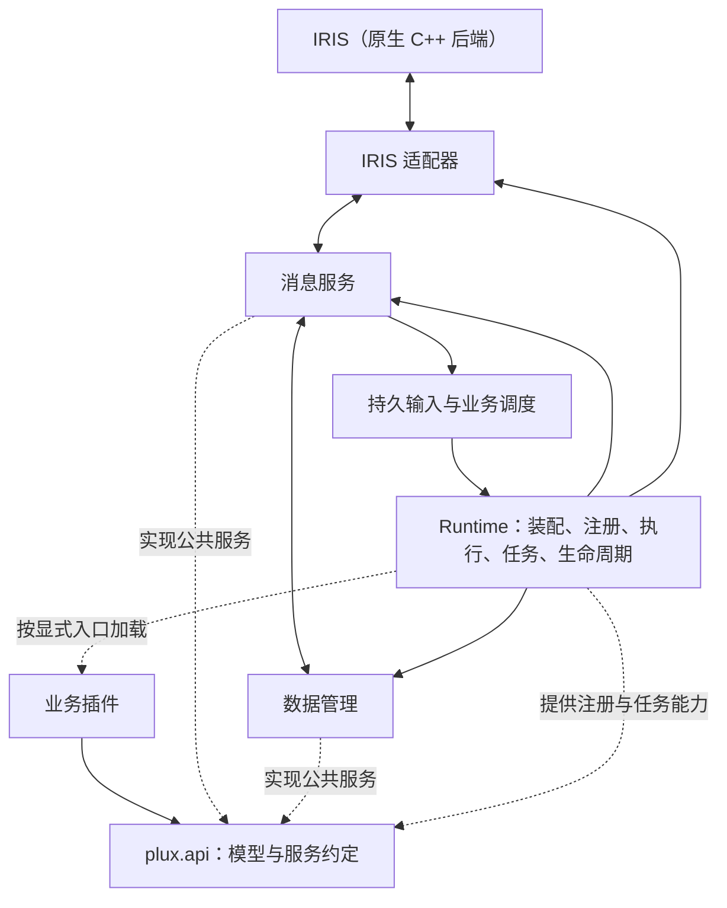

# Plux 框架设计与 Python 重构方案

日期：2026-10-08。设计版本：0.1。实施状态：F1–F5 已完成，F6/F7 待实施；实际能力、限制和运行入口见 [实现指南](implementation.md)。

本文件是 Python 后续重构的当前方案，取代原方案中关于 Python 分层、旧插件兼容、AI 迁移和广播迁移的安排。C++ 已有实现与外部协议单独维护。

## 1. 名称、定位与范围

框架名称为 **Plux**，名称来自 **Plug + Flux**，取 `Plugin`（插件）与 `Flux`（流动/变化）的寓意，强调流动消息与可插拔的业务体系。目标 Python 包为 `plux`，公共接口从 `plux.api` 导入。原生 C++ 后端名称为 **IRIS（彩虹桥）**；Plux 在其上提供消息、数据、任务与插件运行能力。这是本项目内的正式名称，尚未发布软件包。

Plux 是一个面向本地消息应用的 Python 插件框架。首个外部消息适配器连接 IRIS 原生 C++ 后端，首个数据库适配器使用 SQLite；平台能力通过明确接口扩展。

框架负责原生通信、公共数据模型、消息摄取与交付、本地数据资产、任务执行、插件装配和运行生命周期。修仙、帮助、计算器及今后所有业务均通过独立插件接入。

本轮明确排除 AI、记忆和管理员广播的旧实现；框架中不保留这些业务的专用服务。将来可基于公共 API 重新开发。

Python 内部结构、旧插件协议、SQL schema、命令组织、业务调用与状态恢复均允许重新设计。旧代码提供功能与问题样本，不作为新接口的约束。原项目及真实数据不在设计阶段删除或改写；是否转换、如何收尾由部署迁移阶段处理。

## 2. 设计目标与选择

| 目标 | 具体落实 |
| --- | --- |
| 分层解耦 | 公共 API、框架实现、外部适配、业务插件分离；业务仅通过公开能力接入 |
| 职责单一 | 消息、数据、任务和运行分别管理；插件拥有自身规则与业务仓储 |
| 接口统一 | 类型、错误、事务、身份、生命周期和恢复语义一致 |
| 易扩展 | 新插件采用注册与组合；新数据库或消息后端实现适配接口 |
| 服务有广度 | 提供消息、数据库、内容、资源、快照、任务等通用能力，避免核心出现玩家或战斗概念 |
| 可维护 | 资源归属、版本、引用、状态与运行问题可以查询，关键失败能够解释和恢复 |

采用模块化单体、进程内可信插件、显式装配。第一版使用同步原子命令处理器和后台工作器；是否引入 asyncio、多进程或独立插件沙箱，由后续实际需求决定。

接口定义围绕现有需求及签到、投票、游戏、工具等不同场景评审。首版实现具体、完整的基础能力，扩展点同时明确；尚未提供的能力在注册阶段报告不支持，不用空实现伪装成功。

## 3. 总体架构与依赖

图中的消息与调用方向不等于 Python import 方向。静态依赖规则如下：

- `api` 定义公共模型、接口与薄插件入口，不导入实现、适配器或具体插件。
- `data`、`messaging`、`runtime` 使用公共类型与所需窄接口，不静态导入业务包。
- `adapters` 实现数据或消息能力，集中第三方库、操作系统与外部协议细节。
- 插件只导入 `plux.api` 及自身依赖；自身的规则、仓储、状态与展示位于插件包。
- 启动组合按配置加载适配器及插件入口；通用注册器、执行器不判断具体玩法。
- 业务插件间的合作使用显式声明的公开能力，依赖在加载时检查。

公开 API 是契约边界，不增加一个把同样数据再次包装的调用层。完整服务在框架内实现，由 Runtime 创建具插件作用域的服务视图并注入。

## 4. 框架模块职责

| 模块 | 内容 | 对外能力与边界 |
| --- | --- | --- |
| `api` | 消息、回复、资源、状态、错误、插件、服务及调用上下文 | 稳定导入面；业务模型由插件自己定义 |
| `data` | 数据库事务、迁移、配置内容、资产、快照与维护 | 管理数据机制与生命周期；业务校验和数据含义由插件声明 |
| `messaging` | 摄取、规范化、消息查询、成员资料、媒体关联、持久交付与证据 | 提供可组合消息能力，不决定业务规则 |
| `runtime` | 配置、装配、注册、执行器、任务调度、监督、停机与 CLI | 控制资源和执行顺序，不成为通用业务服务容器 |
| `adapters` | 微信 Observer、SQLite、文件系统等具体实现 | 外部边界与实现差异集中维护 |

目标目录及当前状态见 [目录结构](structure.md)，公共接口规格见 [框架 API](framework-api.md)，依赖约束见 [架构约束](architecture.md)。

## 5. 消息与 C++ 通信边界

### 5.1 消息模型

公共 `BaseMessage` 只表达消息身份、账号、会话、发送者、方向、观察时间和必要来源信息。文本、图片、语音和未知内容分型表达各自约束；数据对象不管理连接或执行发送。

稳定 `event_key` 用于消费去重；微信候选消息 ID 另存，不自动成为唯一事实。协议读取失败、截断、提醒未知、历史来源未知等信息保留，不能默认为完整正文或已确认状态。连接变化与工作器错误使用运行事件，不伪装成聊天消息。

对 C++ 事件只做一次协议解码与语义转换，之后平台和插件直接使用公共模型。原始事件保留在消息证据存储，插件通过受限查询接口按需查看。

### 5.2 首个原生适配器

首版对接命名管道协议 v1、JSONL schema 2、精确微信版本资料及当前媒体描述。协议解码、帧传输、端点发现、版本差异和必要的只读群资料适配集中在 `adapters/wechat_observer`。

插件身份、框架事件身份与 wire 字段分别建模。C++ 当前接受 `manual/ai/game` 来源：新业务插件经适配器映射为 wire `game` 类别，人工请求映射 `manual`，`ai` 仅用于历史解析；插件真实 ID 单独持久化。新增 wire 类别需另行修改并验证协议。

发现端点后必须握手、核对账号与会话。连接状态快照包含来源、采样时间和会话代次，旧会话或旧采样更新不能覆盖新状态。实现支持范围与当前可发送性分别查询。

### 5.3 持久摄取与交付

原始事件、规范化消息、读取检查点和可调度输入一起持久化。Runtime 从持久输入领取业务调用，处理记录以插件、处理器、事件为稳定身份；提交后崩溃仍可继续未完成调度。

摄取可以恢复已进入日志的数据；C++ 有界队列丢弃、停机期间遗失的日志和外部消息未被观察到，不在恢复保证内。事件流不提供端到端恰好一次承诺。

回复先保存意图，经交付规划形成固定请求，再持久化尝试后执行原生 I/O。`accepted` 表示本地原生提交事实，不表示收件确认；开始写出后的不确定结果为 `unknown`，不自动重发。追加执行证据不自动改变这个状态。

交付请求形成时固定请求 ID、账号、会话、目标、有效期、文本或 AssetRef 的版本/内容身份及逻辑指纹。切换会话后不改绑旧请求。原生提交准备阶段才解析资产实际路径，并在创建 attempt 前持久化完整 native payload 与协议指纹；准备完成后路径、内容与协议指纹不可静默变化。逻辑资产引用与原生文件保留分别管理，历史已准备或已尝试请求不为搬迁重算指纹。

## 6. 数据管理

### 6.1 数据身份、归属与作用域

资源采用插件或平台命名空间。数据库按实例、schema 和迁移管理；内容按包与版本管理；媒体按资产管理；快照按业务实例管理。普通数据库行无需再注册为通用文件资产。

公共资源引用包含稳定 ID、资源类别及必要版本，不直接暴露任意文件位置。内部元数据保存所有者、实际位置、大小、状态、引用和保留策略。路径根统一由 Runtime 配置，数据库、日志、入站、出站、暂存、缓存各自明确。

### 6.2 数据库与迁移

公开事务及数据库接入约定，首版提供 SQLite。后续关系数据库新增驱动、连接配置、方言仓储与迁移实现；业务逻辑依赖仓储能力，SQL 位于插件或框架各自的数据适配器。

适配器声明支持的事务、条件更新、结构化字段及并发能力；关键能力缺失时明确拒绝启用相关功能。接入数据库驱动不意味着业务 SQL 和一致性保证自动可移植。

平台表与插件表分别拥有独立迁移版本。插件声明迁移及数据库绑定；启动工作器前完成迁移，连接构造函数不执行隐含业务迁移。

一次原子调用中，业务仓储、处理记录、回复意图及任务记录使用同一数据库事务域。第一版默认集中在同一 SQLite 数据库。多数据库可独立访问，但跨库操作不具有这个原子保证，需要持久流程或补偿设计。

### 6.3 配置与内容

部署配置、玩法规则、内容目录分别管理。平台负责包内默认资源、本地显式覆盖、解析、来源诊断、版本、缓存和发布；插件负责类型结构、范围、重复 ID、引用与机制校验。

加载流程为：读取 → 解析 → 合并允许覆盖 → 插件完整校验 → 建立索引 → 发布不可变快照。默认规则和有效内容只有一个权威来源；业务使用内存对象，不按消息反复读文件。

TOML 适合规则及小表，JSON 适合结构化内容。ID、名称、数值、效果参数和模式引用可以外置；算法、事务、效果执行和状态转换留在插件代码。平台不执行内容文件中的任意表达式。

格式版本、规则版本、内容版本与有效覆盖身份分别保存。显式刷新先构造完整新快照，成功后再发布；活动任务固定其规则引用。插件声明何时采用新版本，失败刷新不破坏当前有效快照。

### 6.4 文件资产与暂存

文件资产支持导入、读取、暂存、完整校验、发布、引用和回收。媒体使用流式处理及大小边界；内容相同的不可变资源可以复用。格式识别和编码转换属于消息媒体服务或适配器，通用资产服务只管理字节及资源身份。

暂存文件完成后才发布为可引用资产。业务回滚、进程中断等可能留下未引用文件，维护任务按元数据、状态与保留策略分批处理。文件发布与数据库提交使用可恢复多步流程，不伪装成一次跨资源事务。

已有媒体校验、内容寻址与完整发布机制可提取复用，实现结构可以重写。C++ 可能在提交返回后继续持有图片文件；资源保留需考虑原生会话与发送引用，Python 工作器退出不是释放证明。

### 6.5 状态快照

提供插件作用域的快照 ID、结构版本、修订号、规则引用、截止时间和持久性声明。持久快照支持条件写入，避免迟到任务覆盖新状态。

跨消息的副本、对局等流程优先采用持久可恢复状态。奖励、终态、相关资产变化和通知意图在同一事务提交；重复恢复不重复结算。插件提供旧快照转换、有效性检查、恢复及超时规则。

临时快照可用于无需恢复的中间过程，但须声明与数据库事务的关系。普通内存字典不具备数据库回滚保证；框架不会默认把它作为原子业务状态。

### 6.6 维护与性能

维护视图按所有者、类别、版本、引用、状态和容量查询。回收候选通过元数据索引分批筛选；到期时间只是条件之一，有活动引用、未知发送或恢复任务的资源不能直接删除。

备份按数据库一致视图及其资源引用组成恢复单元，包含必要的媒体和规则版本；可再生缓存单独标记。恢复先验证版本与引用，再启用任务。旧生产数据不在框架设计阶段改写。

性能原则：配置按版本缓存；文件流式处理；快照按状态转换写入；数据库索引围绕领取、身份、状态与截止时间；写事务不包含图片生成、文件复制或外部网络调用。容量与清理工作有边界，出现实际瓶颈后再测量优化。

## 7. 插件公共能力与运行

### 7.1 长期服务与调用上下文

`PluginServices` 是类型明确、插件作用域的公共能力视图，提供 `messages`、`data`、`tasks`、`clock` 和 `logger`。其中数据服务分为数据库、配置内容、资产及快照。它不暴露内部容器或具体业务配置。

`PluginContext` 是短期调用信息：插件 ID、调用 ID、账号、会话、调用者、事件键、权限与观察时间；原子处理期间另绑定有效 Unit of Work。上下文退出后，事务绑定不可继续使用。

插件入口从服务视图装配自己的小型依赖与仓储工厂，处理器按本次作用域绑定仓储。具体公开模型和方法见 [API 规格](framework-api.md)。

### 7.2 注册与装配

薄 `Plugin` 基类要求 `register`，`start/stop` 为可选生命周期。继承只作用于插件入口，内部规则、用例、仓储与展示通过组合实现。

插件清单声明稳定 ID、API 兼容范围、入口、依赖能力、配置校验、迁移、资源和任务。首版 entrypoint 指向插件类，其类级 manifest 可在构造实例前读取，配置校验与迁移声明不依赖实例或业务读写。入口由框架配置显式列出，不通过目录扫描决定业务，也不依赖导入时启动线程。

加载顺序为：读取入口清单与 manifest → 校验依赖与能力 → 加载有效配置 → 轻量构造服务视图与插件 → 注册并检查冲突 → 验证资源并执行迁移 → 执行恢复与启动 → 开放业务调度。构造和注册仅声明元数据，此时服务不执行业务读写。任务启动由 Runtime 管理。

命令冲突默认拒绝启用，允许显式命名空间或优先级策略。事件订阅为每个插件处理器保留独立消费身份；权限、账号、会话和目标校验由公共策略与插件业务校验共同完成。

### 7.3 调用与事务

同步命令和事件处理器声明两种模式：`atomic` 修改持久业务状态，由执行器提供事务；`stateless` 进行无持久副作用计算，结果由框架在短事务中保存处理标记及回复。

原子处理流程：解析与必要准备 → 开启事务 → 检查稳定消费身份 → 绑定仓储 → 执行业务 → 保存状态、快照、任务与回复意图 → 保存处理记录 → 提交。异常回滚本次数据库效果，失败状态另行记录。

图片生成和其他耗时动作通过后台任务推进；命令事务只保存当时的展示输入与任务。已入队的原生请求保持身份与内容稳定，不因渲染重试重新生成一个发送请求。

### 7.4 任务、恢复与停机

提供周期任务与持久后台任务。周期任务负责声明需要推进的工作；持久任务有稳定 ID、状态、租约或修订、截止时间及明确恢复政策，任务与业务状态可一起创建。

任务分为读取/计划、外部执行、结果提交三个阶段。外部副作用重试由插件或适配器声明；租约到期不证明外部动作未发生，`uncertain` 的非幂等操作不自动重新执行。

Runtime 管理工作器、错误、启动恢复和停机预算：停止新入口 → 保存必要业务状态与任务 → 停止回复生产者 → 等待当前发送与摄取 → 释放已结束工作器的资源。超时列出仍活动的工作，不提前关闭其依赖。

首版插件启停通过配置和重启生效；自动热更新不属于首版。停用插件停止入口和任务，数据保留。插件抛异常可隔离为处理失败，但进程内插件不提供恶意代码或死循环的进程隔离保证。

## 8. 业务插件边界

修仙是一个独立插件包，内部组织角色、经济、成长、库存、探索、商店、魔契、斗法、PVP、副本与展示。它拥有规则、内容、业务表、快照、状态机和恢复逻辑。

平台提供数据、消息和执行机制，不包含 PlayerService、BattleService 或修仙专用字段。帮助、计算器同样通过公开接口接入，业务帮助页面属于插件；框架 CLI 只提供运行和维护命令。

规则与内容随插件发布，覆盖配置位于部署数据目录。采用已有机制新增物品或敌人只调整内容；新增机制在插件内实现并注册；新增通用数据库、媒体格式或执行能力通过框架适配接口扩展。

AI、记忆及广播源码仅保留为参考，不注册为新框架模块。已有待处理 AI 或广播记录的终止、必要结算与历史保留，在部署迁移中单独处理。

## 9. 目标结构与命名

新框架位于 `refactored/python/src/plux`；旧 `wechat_receiver` 保留为参考实现，实施时逐步提取有用算法与边界，不要求新 API 反向兼容旧上下文。

业务插件位于框架包之外。修仙目标导入入口为 `plux_plugins.xiuxian:XiuxianPlugin`，代码位于 `refactored/plugins/xiuxian/src/plux_plugins/xiuxian`。第一版工作区插件采用显式配置、包入口和本地开发安装，不修改持久 PATH；具体打包元数据在插件接入批次落地。

命名约定：公开包 `plux.api`；框架内部使用明确的模块路径；插件 ID 为稳定短名称，业务对象 ID 不使用展示名；框架版本、插件 API、数据格式、规则版本与 C++ wire 版本分别维护。

当前只写设计，不创建可导入的空 SDK、不改 pyproject 或 CLI、不迁移代码和数据。目标树详见 [结构说明](structure.md)。

## 10. 实施批次与交付标准

| 批次 | 范围 | 必须得到的结果 |
| --- | --- | --- |
| F1：公共契约与原生边界 | 建立 plux 包、公共模型、错误、微信适配器、运行路径与连接快照 | 独立解析样本、真实 IPC 宿主校验；身份、未知状态和版本错误可表达 |
| F2：数据基础 | 数据库/事务/迁移、内容快照、资产发布、状态快照及基础维护 | 插件无关的数据服务可用；回滚、配置失败、资源中断与条件更新可验证 |
| F3：消息服务 | 持久摄取、输入调度、资料与媒体查询、交付意图/outbox/尝试/证据 | 提交后崩溃可继续调度；不确定发送不重放；会话切换隔离 |
| F4：Runtime 与任务 | 配置装配、注册、调用执行器、持久任务、监督、停机、CLI | 核心在无业务插件时可运行；任务恢复与停止超时明确 |
| F5：插件接入验证 | 薄插件入口、显式包加载、帮助/计算器，加一个有状态计数或签到样板 | 三类插件仅用公开 API；注册、迁移、事务与停用完整成立 |
| F6：修仙插件 | 独立业务设计、规则与内容，角色/采矿样板，再逐步完成其他玩法 | 业务依赖仅面向公开服务；规则与展示同源；长流程持久状态可恢复 |
| F7：部署与维护 | 数据映射、媒体引用、旧任务收尾、启动工具、备份恢复和兼容入口清理 | 迁移在一致副本验证；框架与插件配置可独立维护 |

设计和实现逐批进行。F1 定义各后续能力的接口骨架，实际实现随批次加入；尚未实现的能力明确拒绝注册。F2 的最小完整数据能力是 F3/F4 原子执行与恢复的基础；F5 验证通用 API 后再实现大型修仙业务。

每批保留可以审阅的范围：完成所属行为与最小必要测试，再继续下一批。旧测试中有效的边界与算法样本可复用，断言针对旧结构的测试可重新设计。数据兼容转换不会约束新内部 schema。

## 11. 验证与完成判断

- 框架实现不静态导入插件；插件不导入框架内部适配器。
- 公共模型可独立使用；规范化保留未知和质量信息。
- 事务覆盖业务状态、处理标记、任务和回复；注入失败能够回滚。
- 重复事件、重启和迟到任务不重复结算；有副作用的不确定动作不自动重放。
- 配置与内容完整验证后发布；活动任务规则归属明确。
- 资源引用、暂存、发布、清理与备份恢复能够解释。
- 同一数据库接口可用适配器契约测试验证；新数据库实际接入后再声称支持。
- 无业务插件可启动框架；帮助、计算器及有状态样板无需改核心即可接入。
- 领域算法可以脱离数据库、微信与文件验证；插件行为完成后再做真实业务集成。

使用当前 Python 项目版本约定和现有 unittest；接口设计不自动引入 ORM、队列中间件或新全局依赖。涉及 C++ 协议的工作复用测试宿主，真实微信验证单独进行。

## 12. 设计依据与文档导航

- [公共 API 规格](framework-api.md)、[架构约束](architecture.md)、[目标目录](structure.md)、[配置组织](../config/README.md)。
- [C++ 命令协议](../../cpp/docs/contracts/command-protocol.md)、[事件协议](../../cpp/docs/contracts/event-protocol.md)、[运行生命周期](../../cpp/docs/contracts/runtime-lifecycle.md)。
- [原始项目重构分析](../../docs/refactoring-plan.md) 保留历史分析，Python 当前方案以本文为准。
- [Python DB-API 规范](https://peps.python.org/pep-0249/)：通用驱动约定不消除参数、线程与事务能力差异。
- [Python TOML 解析](https://docs.python.org/3/library/tomllib.html)：文件解析结果可转换为已验证、按版本缓存的运行对象。
- [SQLite 事务](https://www.sqlite.org/lang_transaction.html)：数据库事务范围及单写入者约束是首个适配器的实现条件。

本文确定框架边界及实施方向。具体修仙规则与产品设计在插件批次独立完成；当前没有框架运行验证或业务数据迁移结果。

