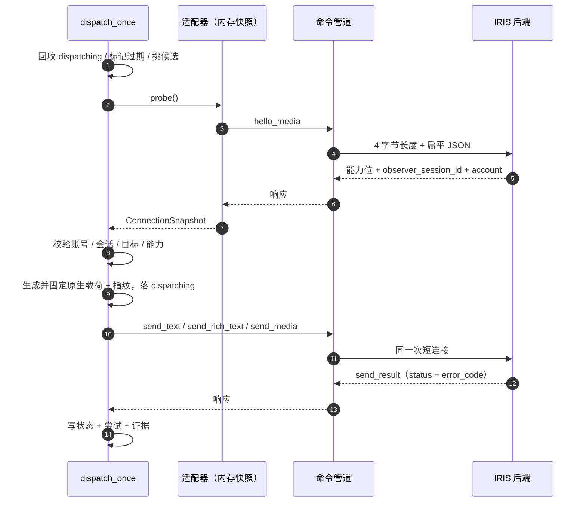

<div align="center">

# 🔌 原生协议规范

[](#)
[](#)
[](#11-帧格式)

<p align="center">
  Plux 与 IRIS/C++ 后端之间的两套线上契约：命令管道与观察日志。
</p>

</div>

---

## 1. 命令管道

### 1.1 帧格式

```
[4 字节小端无符号长度][UTF-8 JSON 载荷]
```

| 规则 | 说明 |
| --- | --- |
| 载荷长度 | 1..65536 字节 |
| JSON | 必须是**扁平对象**：不允许嵌套对象、数组和浮点数；不允许 `NaN`/`Infinity` |
| 键 | 不允许重复键 |
| 编码 | 严格 UTF-8；拒绝孤立代理对 |
| 连接 | **一次连接一次交换**：客户端写入请求、读取响应、关闭句柄 |

客户端（Plux）在整个交换上应用 `observer.timeout_seconds`，I/O 使用带截止时间的重叠操作，超时后取消并等待取消真正完成才释放缓冲。

### 1.2 请求

公共字段：`op`、`protocol_version`（固定 `1`）、`request_id`（≤128）。

| `op` | 追加字段 |
| --- | --- |
| `hello` | 无 |
| `hello_media` | 无 |
| `send_text` | `attempt_id`、`observer_session_id`、`expected_account_id`、`target_id`、`text`、`created_at`、`expires_at`、`origin`、`source_event_key` |
| `send_rich_text` | `send_text` 全部字段 + `at_user_list`（逗号连接）+ 引用字段组 |
| `send_media` | `send_text` 字段去掉 `text`，加 `media_kind`、`media_path`、`media_sha256`、`media_bytes`、`duration_ms` |

字段约束（后端与框架共同保证）：

| 字段 | 约束 |
| --- | --- |
| `attempt_id` | ≤128，每次投递新生成 |
| `observer_session_id` | ≤128，必须等于当前会话 |
| `expected_account_id` | ≤256，等于 `policy.account` |
| `target_id` | ≤512，私聊 wxid 或 `<群ID>@chatroom` |
| `text` | ≤16384 字节（框架侧同样按 16384 校验） |
| `created_at` / `expires_at` | ISO-8601 UTC，如 `2026-10-08T12:00:00.000000Z`；生命周期 ≤600 秒 |
| `origin` | `manual` / `game` / `ai`；Plux 只发 `manual`（人工入队）与 `game`（插件） |
| `source_event_key` | ≤512 或 `null` |
| `at_user_list` | ≤2063 字节；成员 ID 不重复；只能用于群目标 |
| 引用字段 | 9 个 `quote_*`：`quote_message_id`、`quote_from_id`、`quote_to_id`、`quote_sender_id`、`quote_conversation_id`、`quote_text`、`quote_timestamp`、`quote_msg_source`、`quote_message_type` |
| `media_kind` | `image` / `voice` |
| `media_path` | ≤4096，绝对路径，见 [§4 媒体契约](#4-媒体契约) |
| `media_sha256` | 恰好 64 位小写十六进制 |
| `media_bytes` | ≤20 MiB |
| `duration_ms` | ≤60000；语音必须是 20 的整数倍 |

`send_rich_text` 只在有 `at_user_list` 或有引用时使用；否则用 `send_text`。

### 1.3 响应

**hello 响应**（`hello` / `hello_media`）：

| 字段 | 说明 |
| --- | --- |
| `op` | 与请求同名 |
| `protocol_version` | `1` |
| `request_id` | 回显 |
| `observer_session_id` | 当前会话 |
| `target_version` | 必须是 `4.1.13.12` |
| `mode` | `read_only` / `send_enabled` |
| `account_id` | 账号，未就绪时 `null` |
| `account_verified` | 账号是否与配置一致 |
| `send_text` | 必备能力 |
| `send_group_text` / `send_mention` / `send_quote` | 可选能力 |
| `send_image` / `send_voice` | 仅 `hello_media` 返回 |
| `max_text_bytes` | 1..65536 |

Plux 对 hello 响应做**全等字段校验**：出现未识别字段或缺少必备字段都判为不可用，错误信息会列出 `unknown=[...] missing=[...]`。这是刻意的保守策略——后端新增能力字段时必须同步更新适配器。

`hello_media` 返回 `unsupported_operation` 时，Plux 自动退回 `hello` 并把媒体能力视为不可用。

**send_result 响应**：

```json
{ "op": "send_result", "protocol_version": 1, "request_id": "...", "attempt_id": "...",
  "observer_session_id": "...", "status": "accepted", "error_code": null, "error_detail": null }
```

Plux 校验 `protocol_version`、`request_id`、`attempt_id`、`observer_session_id` 与 `status ∈ {accepted, rejected, unknown}`，任何一项不符就记为 `unknown` / `invalid_response`（不会当成成功）。

**error 响应**：

```json
{ "op": "error", "protocol_version": 1, "request_id": "...", "error_code": "...", "error_detail": "..." }
```

### 1.4 错误码与结果分类

Plux 把结果分成三类，直接影响「是否会重发」：

| 来源 | 处理 |
| --- | --- |
| `send_result` 的 `status` | 直接采用后端的 `accepted` / `rejected` / `unknown` |
| `op:"error"` 且错误码在**前置拒绝集** | 记为 `rejected`（确定未发送） |
| `op:"error"` 的其他错误码 | 记为 `unknown`（可能已发送，不自动重发） |
| 传输中断且不确定是否写出 | `unknown` |

前置拒绝集（这些错误只在请求尚未进入发送阶段时产生）：

```
invalid_request  invalid_frame  invalid_utf8  invalid_json
unsupported_operation  unsupported_protocol
```

后端会以 `send_result` 返回的拒绝码（节选，全部按 `rejected` 处理）：

```
session_mismatch              native_sender_unavailable
account_not_verified          target_not_allowed
invalid_timestamp             command_not_yet_valid
command_expired               request_conflict
text_not_allowed              origin_not_allowed
invalid_media                 native_media_sender_unavailable
invalid_mentions              invalid_quote
native_quote_sender_unavailable
busy                          rate_limited
capacity_unavailable
media_path_not_allowed        media_root_unavailable
media_file_unavailable        media_size_mismatch
media_read_failed             media_hash_mismatch
media_format_invalid
```

框架自身产生的错误码（不是后端返回的）：

| 阶段 | 错误码 |
| --- | --- |
| 传输层 | `pipe_unavailable`、`timeout`、`pipe_io_error`、`pipe_closed`、`invalid_request`、`invalid_frame`、`invalid_json`、`winapi_error` |
| 能力门禁 | `native_sender_unavailable`、`native_text_sender_unavailable`、`native_group_sender_unavailable`、`native_mention_sender_unavailable`、`native_quote_sender_unavailable`、`native_image_sender_unavailable`、`native_voice_sender_unavailable` |
| 投递 | `probe_failed`、`identity_or_target_mismatch`、`no_eligible_request`、`not_queued`、`queue_changed`、`invalid_native_payload`、`transport_failure`、`invalid_response` |
| 恢复 | `interrupted_dispatch`、`attempt_already_exists` |
| 队列 | `expired`、`producer_cancelled` |

### 1.5 管道路径发现

管道路径从事件里的 `command_pipe_ready.pipe` 获取，并且必须是 `\\.\pipe\` 下的单个本地组件。也可以配置 `observer.pipe` 固定它。

> [!NOTE]
> `plux.adapters.wechat_observer.transport.DEFAULT_PIPE` 是一个占位常量（`\\.\pipe\wechatbot-send-v1`），与后端按会话命名的实际管道不同。正常路径永远走事件发现；只有直接构造 `NamedPipeTransport()` 才会用到它。

---

## 2. 观察日志

### 2.1 读取模型

- 日志是**只追加**的 JSONL，一行一个记录；Plux 按 `(来源路径, 设备+inode, 代次, 字节偏移)` 续读，每行都在一个事务里与偏移一起提交。
- 文件被截断或替换（`st_size < offset`）时，代次 +1、偏移归零、会话清空，重新从头发读（已存在的事件身份会被识别为重复并记录 issue，不会重复处理）。
- 单行上限 2 MiB；超长行会被截断标记，不会撑爆内存。
- 记录必须是 JSON 对象且含字符串 `kind`；`schema_version` 必须是整数 `2`，否则记为 `unsupported_schema` 并只保留原件。
- `seq`、`call_id`、`observed_unix_ms`、`msg_type` 若出现必须是 0..2^63-1 的整数，否则整条记录判为 `invalid_envelope`。
- 重复键、非有限数值、非法 UTF-8 一律拒绝并记录 `invalid_json`。

### 2.2 事件身份与去重

```
session = 记录里的 session_id，缺失时按来源/代次合成
event_key = f"{session}:{seq}"
```

同一 `event_key` 出现两次：内容相同记为 `duplicate_event`，内容不同记为 `event_identity_conflict`。两者都会保留原始记录，但不会重复产生消息。

> [!NOTE]
> 控制类事件（`observer_start`、`command_pipe_ready` 等）在协议里没有 `seq`，因此它们没有 `event_key`，靠偏移去重。

### 2.3 Plux 读取的字段

| 记录类别 | `kind` | 读取的字段 |
| --- | --- | --- |
| 消息 | `item`、`outbound_item` | `seq`、`observed_unix_ms`、`msg_type`、`from`、`to`、`content`、`msg_source`、`from_read`、`to_read`、`content_read`、`source_read`、`raw_fields`、`vtable_match`、`media_key` |
| 控制 | `observer_start`、`command_pipe_ready`、`command_pipe_error`、`native_sender_disabled`、`observer_disabled`、`dropped` | `session_id`、`pipe`、`protocol_version` |
| 媒体 | `media_asset`、`media_encoded_asset` | `media_key`、`asset_id`、`message_id`、`status`、`event_key` |
| 发送证据 | `native_send_request`、`native_send_result` | `request_id` |
| 其他 | 任意 | 只留档，不产生业务效果 |

`*_read` 诊断对象的 `status` 为 `ok` 或 `empty` 视为可读，其他值会让对应字段被丢弃并记一条 issue（例如 `content_unverified`）。诊断对象缺失时按旧格式降级：字段为空串记 `legacy_unknown_empty`，否则记 `legacy_unverified`。

### 2.4 消息到公共模型的映射

| 条件 | 结果 |
| --- | --- |
| `msg_type == 1` 且内容可读 | `TextMessage` |
| `msg_type == 3` | `ImageMessage` |
| `msg_type == 34` | `VoiceMessage` |
| 其余、或内容不可读 | `UnknownMessage`（带 `content_unavailable` 等 issue） |

方向判定：

| 条件 | `direction` | `conversation` |
| --- | --- | --- |
| `kind == outbound_item` | `outbound_request` | `to` |
| `from` 是群，内容带 `发送者:` 前缀 | `inbound` / `self_sync` | `from` |
| `from == account` | `self_sync` | `to` |
| `to == account` | `inbound` | `from` |
| `vtable_match` 为假，或无法判定 | `unknown` | 空 |

群消息缺少 `发送者:` 前缀时 actor 为空、方向为 `unknown`：**这条消息不会进入待处理队列**，只作为历史留档。

`msg_source` 会被严格解析（拒绝 DTD/实体）以提取 `atuserlist`，得到 `mentions_status`：包含本账号为 `explicit_self`，否则 `explicit_other`，解析失败为 `unknown`。

### 2.5 控制事件与会话

| 事件 | 效果 |
| --- | --- |
| `observer_start` | 记录会话；在未固定 `expected_session` 时会话变化会让旧会话作废、管道路径清空 |
| `command_pipe_ready` | 校验 `protocol_version == 1` 与管道路径格式，记录为当前发送端点 |
| `command_pipe_error` / `native_sender_disabled` / `observer_disabled` | 连接快照转为 `disconnected` 并记录 issue |
| `dropped` | 记录为 issue（代表后端承认丢弃了记录） |

> [!CAUTION]
> 后端目前对「每批最多记录 32 条」的截断不产生任何事件。Plux 已经准备好处理 `dropped`，但在后端补上之前，高流量窗口下的静默丢件在框架侧无法感知。

---

## 3. 发送生命周期

```
queued → dispatching → accepted / rejected / unknown
              ↘ (进程崩溃) → unknown / interrupted_dispatch
```

一次投递在时间轴上是这样：



投递前 Plux 会：读连接快照 → 校正账号、目标与会话 → 校验能力 → 生成并固定原生载荷（含引用/提醒/媒体路径）→ 写入指纹 → 落 `dispatching` 尝试 → 交换 → 记录结果与证据。

`native_json` 与 `native_fingerprint` 一旦写入就不再改变；后续任何重放都要先通过指纹与身份校验，防止「用旧路径发新内容」。

---

## 4. 媒体契约

发送图片或语音时，文件必须满足后端的准入校验：

| 要求 | 说明 |
| --- | --- |
| 位置 | 父目录**恰好**是 `WECHATBOT_MEDIA_ROOT`（即 `paths.outbound`），不允许子目录 |
| 文件名 | 主文件名**恰好等于**小写十六进制 SHA-256，扩展名受限 |
| 图片扩展名 | `.png` / `.jpg` / `.jpeg` |
| 语音扩展名 | `.silk` |
| 大小 | 图片 ≤20 MiB，语音 ≤1 MiB |
| 内容 | 后端会重算 SHA-256；图片校验魔数头尾，语音校验 SILK 帧结构 |
| 语音时长 | `duration_ms` 必须等于后端按 SILK 帧算出的时长，且是 20 的整数倍 |

插件的资产落在内容寻址目录里（`<asset_id[:2]>/<asset_id>`，无扩展名），**不能**直接交给后端。交付层会做一次原生导出：

1. 解析并校验资产（大小、SHA-256）；
2. 按容器魔数决定扩展名（PNG / JPEG / SILK），不支持的容器直接拒绝；
3. 以 `<sha256><扩展名>` 硬链接（跨卷时退化为复制 + 原子改名）到媒体根目录的直接子级；
4. 用导出路径、摘要与字节数组装 `send_media` 请求。

导出的副本不在引用表里，因此维护回收不会删除它们；数量以「曾经发送过的不同内容」为上限。

> [!WARNING]
> 语音的 `duration_ms` 由插件负责。框架不解析 SILK 帧，因此错误的时长会被后端拒绝为 `media_format_invalid`。

---

## 5. 兼容性

| 契约 | 当前值 | 变更影响 |
| --- | --- | --- |
| `protocol_version` | `1` | 不匹配时后端返回 `unsupported_protocol` |
| 事件 `schema_version` | `2` | 不匹配记为 `unsupported_schema`，记录留档但不产生消息 |
| 目标微信版本 | `4.1.13.12` | 由 `observer.target_version` 与 hello 响应双向校验 |
| `TARGET_VERSION` 常量 | `4.1.13.12` | 适配器硬编码，升级需要同步改代码与配置 |

升级微信或后端时的顺序：先更新 C++ 侧的 Hook 与 `TARGET_VERSION`，再同步 `config.observer.target_version` 与适配器常量，最后核对 hello 响应字段集（全等校验会在后端新增字段时立即报错，这是有意的失败快照）。
